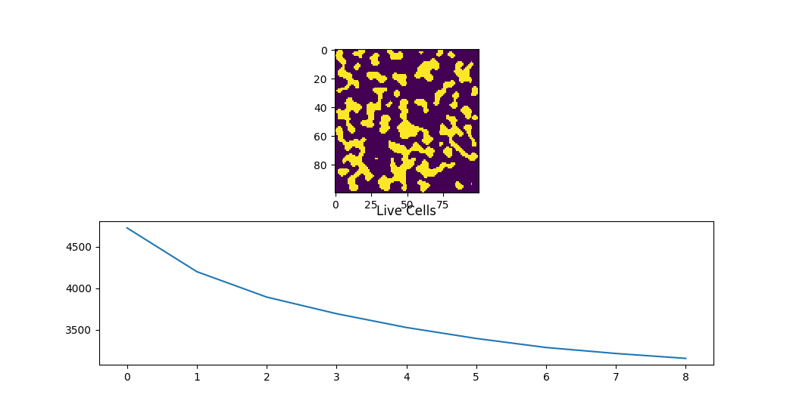

# Simple Cellular Automaton

This repo includes an implementation of a cellular automaton to generate a simple terrain-like structure, from noise.  
It was created as a fun night of code and intended to try out Replit, practice using numpy and learn more about CAs.  

The implementation includes 3 main stages:  

1. Generate initial state  
2. Run the CA rule for a few iterations  
3. Display the results  

This implementations keeps all the intermediate states so that they can be later displayed or analysed.  
Results displayed include the full sequence of states and a plot of the number of live cells over time.  

### Analysis

Looking at 2 runs at random, with the current settings, the automaton seems to converge quickly, around the 10 iterations.  

40 iterations | 8 iterations
:------------:|:-------------|
 | 

### Disclaimers

I tried to keep it short and simple too and hopefully most functions have self-evident intentions.  
No attempts were made at optimising the code.  

### Next time...

* Experiment with stochastic implementations.  
* Use a higher-level plotting library (matplotlib is messy IMO).  

## Running

Run the repl at [KosmiCKhaoz/Automaton](https://replit.com/@KosmiCKhaoz/Automaton#main.py) .  
Some tests provided on the platform.  

P.s. Replit is 🤩

---

## Attributions
  
The idea for the implementation originated from watching the beginning of Klayton Kowalski's video on Procedural Map Generation https://youtu.be/slTEz6555Ts  

The logic is losely based of reading a couple of random resources on cellular automaton and has not been validated or reviewed.